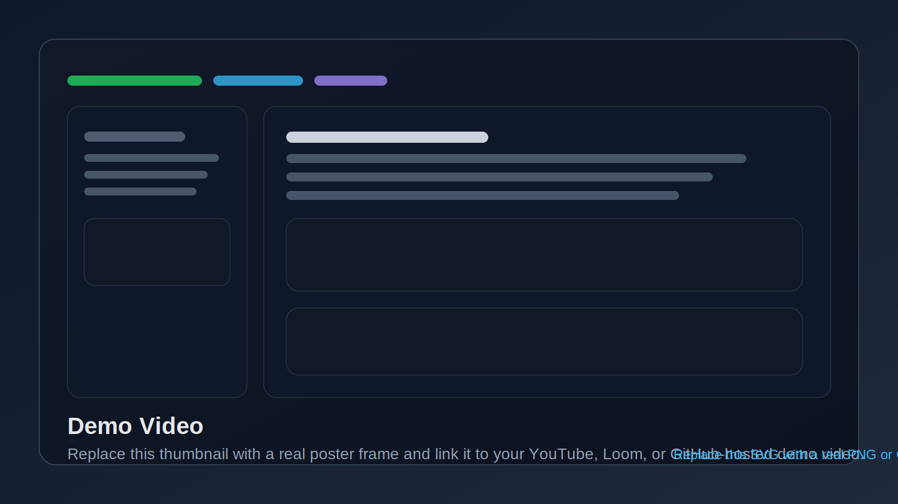
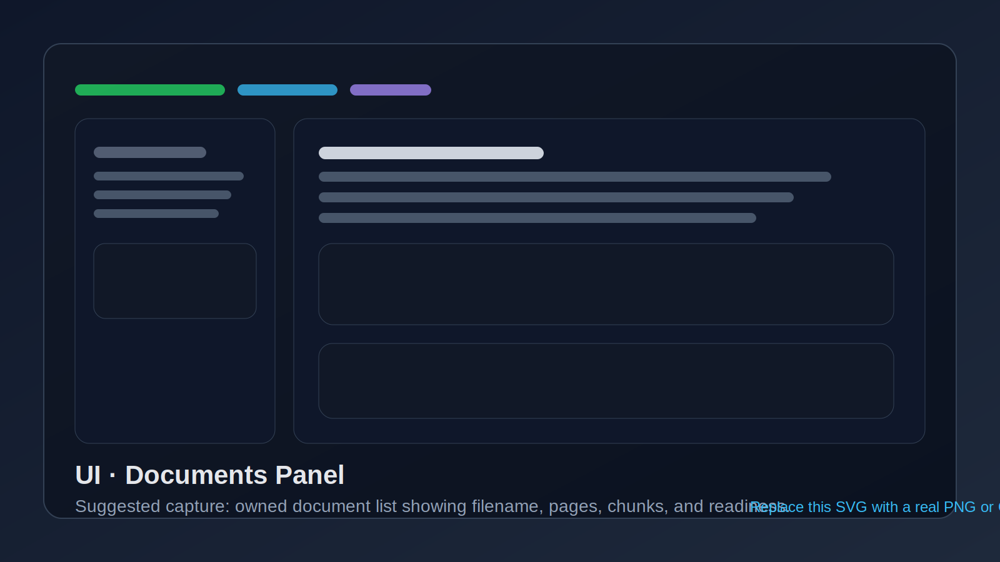
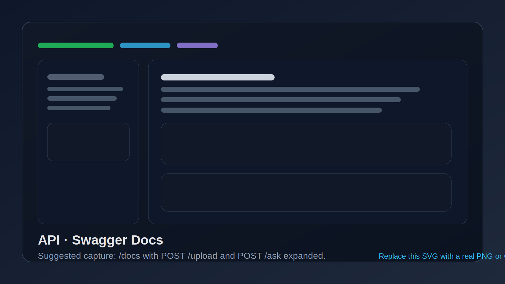
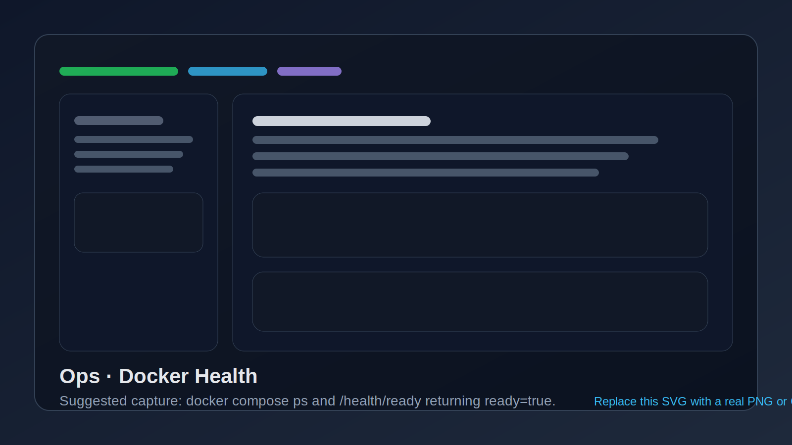
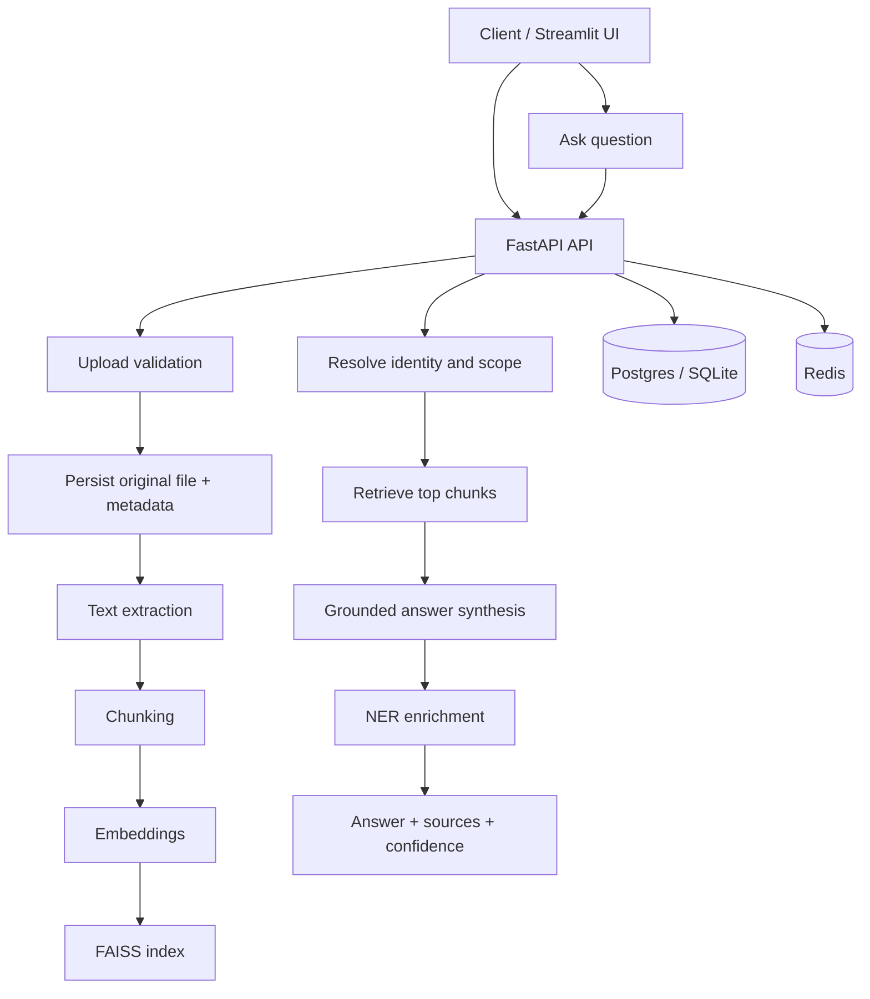
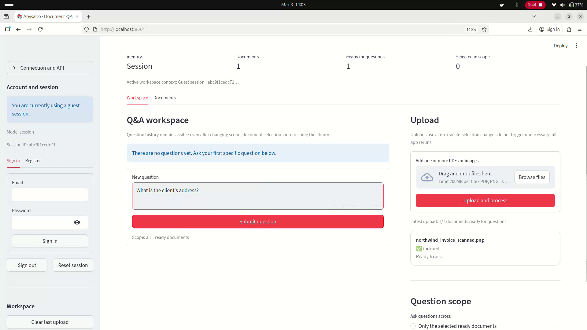

# Abysalto · AI-driven Document Insight Service

<div align="center">

[](https://github.com/fs53251/abysalto-docqa-backend/actions/workflows/ci.yml)
[](https://github.com/fs53251/abysalto-docqa-backend/commits/main)
[](https://github.com/fs53251/abysalto-docqa-backend)
[](https://github.com/fs53251/abysalto-docqa-backend)
[](#manual-installation)
[](#architecture)
[](#docker-installation-recommended)
[](#architecture)
[](#docker-installation-recommended)

</div>

> Production-style FastAPI backend for document upload, OCR/text extraction, retrieval-first question answering, ownership isolation, and Docker-ready local deployment.

**Repository:** `fs53251/abysalto-docqa-backend`  
**Project package:** `abysalto-project`  
**Primary stack:** FastAPI · SQLAlchemy · PyMuPDF · EasyOCR · Sentence Transformers · FAISS · Redis · Streamlit · Docker Compose

---

## Table of contents

- [Why this project exists](#why-this-project-exists)
- [Feature overview](#feature-overview)
- [Assignment coverage](#assignment-coverage)
- [Demo preview](#demo-preview)
- [Architecture](#architecture)
- [Repository structure](#repository-structure)
- [Approach and technical choices](#approach-and-technical-choices)
- [Setup instructions](#setup-instructions)
- [Manual installation](#manual-installation)
- [Docker installation (recommended)](#docker-installation-recommended)
- [Configuration and secrets](#configuration-and-secrets)
- [API reference](#api-reference)
- [Example API requests and responses](#example-api-requests-and-responses)
- [UI walkthrough](#ui-walkthrough)
- [Testing and quality](#testing-and-quality)
- [How to record and embed a demo video](#how-to-record-and-embed-a-demo-video)
- [Troubleshooting](#troubleshooting)
- [What this final Dockerized project gives you](#what-this-final-dockerized-project-gives-you)
- [Roadmap](#roadmap)

---

## Why this project exists

This repository implements an **AI-driven Document Insight Service**: a backend that accepts PDFs and images, extracts text from them, indexes the content locally, and answers grounded questions over the uploaded documents.

The goal was not to build a single demo endpoint, but a **small production-style service** with the parts you would expect in a real repository:

- layered FastAPI application structure
- document ownership isolation for both guests and authenticated users
- OCR fallback for scanned documents
- retrieval-first QA pipeline with explainable sources
- Redis-backed cache and rate limiting
- JWT authentication
- health endpoints, Docker, CI, and a small Streamlit UI

---

## Feature overview

### Core capabilities

- Upload **one or more** documents through `POST /upload`
- Accept **PDF, PNG, JPG, JPEG, TIF, TIFF** inputs
- Extract text from:
  - native PDFs via **PyMuPDF**
  - scans and images via **EasyOCR** fallback
- Ask questions over:
  - all documents you own, or
  - an explicit subset of `doc_ids`
- Return:
  - grounded answer text
  - confidence metadata
  - supporting source chunks
  - named entities

### Production-minded additions

- **RAG pipeline** with local embeddings + FAISS
- **Session-based ownership** for anonymous users
- **JWT authentication** for registered users
- **Document claiming** when a guest later logs in
- **Redis caching** and **rate limiting**
- **Structured logging** with request IDs
- **Docker Compose** stack for API + UI + Redis + Postgres
- **GitHub Actions CI**

---

## Assignment coverage

| Requirement | Status | Implementation |
|---|---:|---|
| Setup instructions | ✅ | Included below for both manual and Docker workflows |
| Manual installation instructions | ✅ | Poetry, Redis, migrations, API/UI startup |
| Docker option instructions | ✅ | Full Compose stack with API, UI, Redis, Postgres |
| Example API requests and responses | ✅ | Included for auth, upload, ask, list, delete, health |
| Brief description of approach | ✅ | See [Approach and technical choices](#approach-and-technical-choices) |
| Optional screenshots / video / creative additions | ✅ | Screenshot sections, demo thumbnail, recording plan |

---

## Demo preview

> The README is already wired for visual assets. The files referenced below are included as **professional placeholders**. Replace them with real screenshots or a real video thumbnail using the same filenames and the README will update automatically.

[](https://github.com/fs53251/abysalto-docqa-backend)

<div align="center">
  
  
</div>
<div align="center">
  
  
</div>
<div align="center">
  
  
</div>

---

## Architecture

### End-to-end flow



### Runtime components

| Component | Role |
|---|---|
| **FastAPI API** | Request validation, authentication, document lifecycle, retrieval, QA, health endpoints |
| **Postgres / SQLite** | Persistence for users and document metadata |
| **Redis** | Cache layer and rate limiting |
| **PyMuPDF** | Native PDF text extraction |
| **EasyOCR** | OCR fallback for scans and images |
| **Sentence Transformers** | Local embedding generation |
| **FAISS** | Fast local vector retrieval |
| **spaCy** | NER enrichment of answers/evidence |
| **Streamlit UI** | Lightweight interactive demo workspace |

### Processing stages

| Stage | Purpose | Main implementation |
|---|---|---|
| Upload | Validate, store, hash, register ownership | `app/api/routes/upload.py` |
| Extraction | PDF text extraction or OCR fallback | `app/services/ingestion/` |
| Chunking | Split text into retrieval-friendly segments | `app/services/indexing/chunking.py` |
| Embedding | Convert chunks into vectors | `app/services/indexing/embedding_service.py` |
| Indexing | Build local FAISS index | `app/services/indexing/faiss_index.py` |
| Retrieval | Find relevant evidence chunks | `app/services/retrieval/retriever.py` |
| QA | Synthesize grounded answer | `app/services/qa/` |
| NER | Extract entities from answer/evidence | `app/services/ner/ner_service.py` |

---

## Repository structure

```text
app/
  api/                # FastAPI routes and dependency wiring
  core/               # config, middleware, security, logging, errors
  db/                 # SQLAlchemy base, models, engine/session helpers
  models/             # Pydantic request/response schemas
  repositories/       # database access layer
  services/           # ingestion, indexing, retrieval, QA, cache, NER
  storage/            # filesystem path helpers and metadata utilities
  main.py             # FastAPI application entry point
alembic/              # database migrations
scripts/              # smoke tests, cleanup, model preloading
ui/                   # Streamlit demo frontend
Dockerfile            # API image build
Dockerfile.ui         # UI image build (via docker/Dockerfile.ui)
docker-compose.yml    # local stack orchestration
data/test_docs/       # sample demo documents
.github/workflows/    # CI pipeline
```

### Sample test documents already included

- `data/test_docs/TechAssignment_AI Backend Developer.pdf`
- `data/test_docs/northwind_invoice_scanned.pdf`
- `data/test_docs/northwind_invoice_scanned.png`

---

## Approach and technical choices

### Retrieval-first design

The system is intentionally built as a **retrieval-first QA service**, not a raw prompt-to-model wrapper.

That means the backend:

1. extracts text from the uploaded document,
2. chunks that text,
3. embeds each chunk,
4. retrieves the most relevant chunks for a user question,
5. synthesizes an answer from those retrieved chunks,
6. returns the answer together with the supporting evidence.

This keeps answers **grounded in the user's documents** and improves transparency.

### Why these tools were chosen

**FastAPI**
- excellent request validation with Pydantic
- clean REST design
- automatic interactive docs at `/docs`

**PyMuPDF + EasyOCR**
- PyMuPDF is reliable for native PDF extraction
- EasyOCR covers scans and images without requiring an external OCR service
- together they handle the most common business document cases

**Sentence Transformers + FAISS**
- practical local retrieval stack
- strong enough for demos and portfolio work
- low operational complexity compared with an external vector database

**OpenAI as optional synthesis**
- improves answer fluency when enabled
- the application still works without it through a grounded fallback path
- useful for local demos, offline-ish development, and cost control

**Redis**
- well suited for response caching, embedding reuse, and request rate limiting

**SQLAlchemy + Alembic**
- mature and maintainable persistence layer
- clean separation between domain logic and storage

### Ownership model

The application supports **two identity modes**:

- **guest session**: the user can upload and ask questions before registering
- **authenticated user**: after login, documents belong to the user identity

A particularly useful detail is that **guest-session documents can be claimed by the user** once they register or log in.

---

## Setup instructions

### Option A — fastest path with Docker

```bash
git clone https://github.com/fs53251/abysalto-docqa-backend.git
cd abysalto-docqa-backend
cp .env.docker.example .env
```

Edit `.env`, replace the placeholder secrets, then run:

```bash
docker compose up --build
```

Open these URLs:

- API docs: `http://localhost:8000/docs`
- API readiness: `http://localhost:8000/health/ready`
- Streamlit UI: `http://localhost:8501`

### Option B — manual local setup

```bash
git clone https://github.com/fs53251/abysalto-docqa-backend.git
cd abysalto-docqa-backend
poetry install
cp .env.example .env
```

Then follow the [Manual installation](#manual-installation) section below.

---

## Manual installation

### 1) Prerequisites

- Python **3.12+**
- **Poetry**
- **Redis** running locally
- Optional but recommended: a clean virtual environment managed by Poetry

### 2) Install dependencies

```bash
poetry install
```

### 3) Create your environment file

```bash
cp .env.example .env
```

### 4) Recommended local `.env` values

#### Local run without OpenAI

```env
ENV="dev"
DATABASE_URL="sqlite:///./data/app.db"
REDIS_URL="redis://localhost:6379/0"
QA_USE_OPENAI="false"
OPENAI_API_KEY=""
LOG_LEVEL="INFO"
```

#### Local run with OpenAI synthesis enabled

```env
QA_USE_OPENAI="true"
OPENAI_API_KEY="your_real_key_here"
QA_MODEL_NAME="gpt-4o-mini"
```

### 5) Start Redis

If you already have Redis installed:

```bash
redis-server
```

Or use the provided helper:

```bash
make redis-start
```

### 6) Prepare the database

For a professional local setup, run migrations:

```bash
poetry run alembic upgrade head
```

### 7) Optional: preload local models and caches

This avoids waiting for the first model download during your demo run.

```bash
poetry run python scripts/preload_models.py
```

### 8) Run the API

```bash
make run
```

### 9) Run the UI in a second terminal

```bash
make run-ui
```

### 10) Open the app

- API docs: `http://127.0.0.1:8000/docs`
- Streamlit UI: `http://127.0.0.1:8501`

---

## Docker installation (recommended)

### Why Docker is the recommended mode

The Compose setup gives you the most reproducible demo and the cleanest onboarding. It starts:

- `api` — FastAPI backend
- `ui` — Streamlit frontend
- `redis` — cache + rate limiting
- `db` — Postgres database

### 1) Prepare environment

```bash
cp .env.docker.example .env
```

Replace at least these values:

```env
POSTGRES_PASSWORD="replace_me"
JWT_SECRET="replace_me"
SESSION_COOKIE_SECRET="replace_me"
OPENAI_API_KEY=""
```

### 2) Build and run

```bash
docker compose up --build
```

### 3) Run in detached mode

```bash
docker compose up --build -d
```

### 4) Inspect logs

```bash
docker compose logs -f api ui db redis
```

### 5) Stop the stack

```bash
docker compose down
```

### Published ports

| Service | URL |
|---|---|
| API | `http://localhost:8000` |
| Swagger UI | `http://localhost:8000/docs` |
| Readiness endpoint | `http://localhost:8000/health/ready` |
| Streamlit UI | `http://localhost:8501` |
| Redis | `localhost:6379` |
| Postgres | `localhost:5432` |

---

## Configuration and secrets

`app/core/config.py` is the **single source of truth** for runtime settings.

### Recommended environment files

- `.env.example` → template for manual/local development
- `.env.docker.example` → template for Docker Compose
- `.env` → your untracked local environment

### Never commit real values for

- `JWT_SECRET`
- `SESSION_COOKIE_SECRET`
- `OPENAI_API_KEY`
- real database passwords
- any production credentials

### Safe to commit

- `.env.example`
- `.env.docker.example`
- `docker-compose.yml`
- `README.md`
- application config code without real secret values

---

## API reference

### Main user-facing endpoints

| Method | Endpoint | Purpose |
|---|---|---|
| `POST` | `/upload` | Upload one or more documents |
| `POST` | `/ask` | Ask a grounded question over owned documents |
| `GET` | `/documents` | List owned documents |
| `GET` | `/documents/{doc_id}` | Get document details and artifact state |
| `DELETE` | `/documents/{doc_id}` | Delete a document and its stored artifacts |
| `POST` | `/auth/register` | Create an account |
| `POST` | `/auth/login` | Obtain JWT access token |
| `GET` | `/auth/me` | Get current authenticated user |
| `GET` | `/auth/identity` | Inspect current identity mode |
| `GET` | `/health` | Liveness check |
| `GET` | `/health/ready` | Readiness check |

### Developer/diagnostic endpoints also present

| Method | Endpoint | Purpose |
|---|---|---|
| `POST` | `/documents/{doc_id}/extract-text` | Force extraction |
| `GET` | `/documents/{doc_id}/text` | Read extracted text artifact |
| `POST` | `/documents/{doc_id}/chunk` | Build chunks |
| `POST` | `/documents/{doc_id}/embed` | Build embeddings |
| `POST` | `/documents/{doc_id}/index` | Build FAISS index |
| `POST` | `/documents/{doc_id}/search` | Search indexed chunks |

---

## Example API requests and responses

> The examples below are intentionally written in a way that you can copy into your README as-is and use in your presentation.

### 1) Register a user

```bash
curl -X POST http://localhost:8000/auth/register \
  -H "Content-Type: application/json" \
  -d '{
    "email": "user@example.com",
    "password": "supersecret123"
  }'
```

Example response:

```json
{
  "id": "2f3f11df-4fd1-47f8-b4f8-91ef0d2683ee",
  "email": "user@example.com",
  "is_active": true
}
```

### 2) Login and get a bearer token

```bash
curl -X POST http://localhost:8000/auth/login \
  -H "Content-Type: application/json" \
  -d '{
    "email": "user@example.com",
    "password": "supersecret123"
  }'
```

Example response:

```json
{
  "access_token": "<JWT_TOKEN>",
  "token_type": "bearer",
  "expires_in": 3600
}
```

### 3) Upload a document

```bash
curl -X POST http://localhost:8000/upload \
  -H "Authorization: Bearer <JWT_TOKEN>" \
  -F "files=@data/test_docs/northwind_invoice_scanned.pdf"
```

Example response:

```json
{
  "documents": [
    {
      "filename": "northwind_invoice_scanned.pdf",
      "status": "indexed",
      "status_detail": "Ready to ask.",
      "ready_to_ask": true,
      "doc_id": "8d7cf10cb6954f2daa7317c2a85fbc2f",
      "content_type": "application/pdf",
      "size_bytes": 284733,
      "sha256": "9a2a8d1c1c6ec3af9f8db3b99a8f5dce7a0a4bc146e2cf4f9bb4bf2cb3bfb2e2",
      "owner_type": "user",
      "error_detail": null
    }
  ],
  "has_errors": false
}
```

### 4) Ask a question over the uploaded document

```bash
curl -X POST http://localhost:8000/ask \
  -H "Authorization: Bearer <JWT_TOKEN>" \
  -H "Content-Type: application/json" \
  -d '{
    "question": "Who is the invoice issuer?",
    "scope": "docs",
    "doc_ids": ["8d7cf10cb6954f2daa7317c2a85fbc2f"],
    "top_k": 5
  }'
```

Example response:

```json
{
  "answer": "The invoice issuer is Northwind Traders.",
  "grounded": true,
  "confidence": 0.91,
  "confidence_label": "high",
  "message": null,
  "sources": [
    {
      "doc_id": "8d7cf10cb6954f2daa7317c2a85fbc2f",
      "filename": "northwind_invoice_scanned.pdf",
      "page": 1,
      "chunk_id": "chunk_0001",
      "score": 0.93,
      "semantic_score": 0.91,
      "lexical_score": 0.77,
      "text_excerpt": "Northwind Traders ..."
    }
  ],
  "entities": [
    {
      "text": "Northwind Traders",
      "label": "ORG",
      "start": 23,
      "end": 40
    }
  ]
}
```

### 5) List your documents

```bash
curl http://localhost:8000/documents \
  -H "Authorization: Bearer <JWT_TOKEN>"
```

Example response:

```json
{
  "documents": [
    {
      "doc_id": "8d7cf10cb6954f2daa7317c2a85fbc2f",
      "filename": "northwind_invoice_scanned.pdf",
      "content_type": "application/pdf",
      "size_bytes": 284733,
      "status": "indexed",
      "status_detail": "Ready to answer questions.",
      "ready_to_ask": true,
      "created_at": "2026-03-08T10:15:21.114253",
      "indexed_at": "2026-03-08T10:15:28.403182",
      "pages": 1,
      "chunks": 7,
      "owner_type": "user",
      "owner_id": "2f3f11df-4fd1-47f8-b4f8-91ef0d2683ee"
    }
  ],
  "count": 1
}
```

### 6) Delete a document

```bash
curl -X DELETE http://localhost:8000/documents/8d7cf10cb6954f2daa7317c2a85fbc2f \
  -H "Authorization: Bearer <JWT_TOKEN>"
```

Example response:

```json
{
  "doc_id": "8d7cf10cb6954f2daa7317c2a85fbc2f",
  "status": "deleted"
}
```

### 7) Health and readiness

```bash
curl http://localhost:8000/health
curl http://localhost:8000/health/ready
```

Example readiness response:

```json
{
  "status": "ok",
  "ready": true,
  "checks": {
    "db": {
      "ready": true,
      "detail": "reachable"
    },
    "redis": {
      "ready": true,
      "detail": "reachable"
    },
    "services_initialized": {
      "ready": true,
      "required": [
        "embedding_service",
        "qa_service"
      ],
      "services": {
        "embedding_service": {
          "ready": true,
          "detail": "initialized"
        },
        "qa_service": {
          "ready": true,
          "detail": "initialized"
        }
      }
    }
  }
}
```

---

## UI walkthrough

The Streamlit UI is designed as a simple but polished demo workspace.

### What you can show in a live demo

1. Open the workspace at `http://localhost:8501`
2. Upload a PDF or image from `data/test_docs/`
3. Show that the document becomes ready to ask over
4. Ask a concrete question such as:
   - `Who is the invoice issuer?`
   - `What is the total amount?`
   - `What is the due date?`
5. Show the answer, confidence, entities, and source excerpts
6. Open Swagger at `http://localhost:8000/docs` to prove the API contract

### Screenshot sections ready for real images

#### 1. Workspace overview


*Suggested capture:* the Streamlit landing state with sidebar, upload panel, and document workspace visible.

#### 2. Upload result


*Suggested capture:* a successful upload with `indexed` status and a visible `doc_id`.

#### 3. Documents panel


*Suggested capture:* the list of owned documents with page count, chunk count, and readiness state.

#### 4. Ask response


*Suggested capture:* a question, grounded answer, source snippets, and entities.

#### 5. API docs


*Suggested capture:* `/docs` with `POST /upload` and `POST /ask` expanded.

#### 6. Docker health / readiness


*Suggested capture:* `docker compose ps` plus `/health/ready` returning `ready: true`.

---

## Testing and quality

### Local quality commands

```bash
make test
make lint
poetry run black --check .
```

### Convenience targets

```bash
make run
make run-ui
make docker-up-build
make docker-logs
make clean
make smoke
```

### CI

The repository includes a GitHub Actions workflow at:

```text
.github/workflows/ci.yml
```

It currently runs:

- dependency installation with Poetry
- Ruff linting
- Black formatting check
- Pytest suite

---

## How to record and embed a demo video

### Recommended demo structure (60–90 seconds)

1. Show the repository and README briefly
2. Start the stack with `docker compose up --build`
3. Open Streamlit UI
4. Upload `northwind_invoice_scanned.pdf`
5. Ask 2–3 good questions
6. Open Swagger docs
7. Show `/health/ready`
8. End on the message that the whole stack is Dockerized and reproducible

### Recommended assets to create

- **1 full video** for YouTube, Loom, or GitHub release assets
- **1 short GIF** of the UI in action for the README hero section
- **6 screenshots** matching the filenames already referenced in this README

### Suggested file locations

```text
docs/assets/demo/demo-thumbnail.png
docs/assets/demo/demo.gif
docs/assets/screenshots/01-workspace-overview.png
docs/assets/screenshots/02-upload-result.png
docs/assets/screenshots/03-documents-panel.png
docs/assets/screenshots/04-ask-response.png
docs/assets/screenshots/05-api-docs.png
docs/assets/screenshots/06-docker-health.png
```

### Fast recording recipe

#### Option A — OBS Studio

- Record the browser or desktop at 1080p
- Use 125% browser zoom so text is readable on GitHub or YouTube
- Keep the mouse movement slow and intentional
- Avoid long waits by preloading models first

#### Option B — Screen Studio / Loom / CleanShot

- Good for polished cursor movement and quick sharing
- Export MP4 for the full video
- Export GIF for the short README preview

### Convert video to a short GIF with `ffmpeg`

```bash
ffmpeg -ss 00:00:05 -t 00:00:08 -i demo.mp4 \
  -vf "fps=12,scale=1440:-1:flags=lanczos" \
  docs/assets/demo/demo.gif
```

### Generate a thumbnail image from the video

```bash
ffmpeg -ss 00:00:06 -i demo.mp4 -vframes 1 docs/assets/demo/demo-thumbnail.png
```

### Replace the placeholder thumbnail link in this README

Use this block once your video is uploaded:

```md
[](https://your-video-url-here)
```

### Pro tip

Use the exact filenames already referenced by this README. Then you only replace files, not markdown.

---

## Troubleshooting

### The first startup is slow

That is expected if embeddings, EasyOCR, or spaCy models are downloading for the first time. To reduce live-demo latency:

```bash
poetry run python scripts/preload_models.py
```

### Redis connection errors in manual mode

Make sure Redis is running locally:

```bash
redis-cli ping
```

Expected output:

```text
PONG
```

### Docker containers are up but the UI is not ready yet

Check service health and logs:

```bash
docker compose ps
docker compose logs -f api ui db redis
```

### OpenAI is not configured

That is okay. The application still works in fallback mode when `QA_USE_OPENAI=false`.

---

## What this final Dockerized project gives you

Once the project is Dockerized and running, you have a reproducible local stack that you can:

- demo to a mentor, recruiter, or reviewer
- publish to GitHub as a polished backend portfolio project
- extend into a more advanced document-QA product
- use as a base for worker queues, cloud storage, better observability, or deployment to a cloud platform

In practical terms, the Dockerized version means:

- the environment is reproducible
- onboarding is faster
- the service is easier to test end-to-end
- the repo looks and behaves like a real software project, not just a notebook or script

---

## Roadmap

High-value next steps would be:

- background job workers for ingestion/indexing
- S3-compatible object storage
- pgvector or managed vector database support
- richer access-control policies
- async document processing queue
- observability stack with metrics and tracing
- deployment profiles for Railway / Render / ECS / Kubernetes

---

## Final note

This README is intentionally written as a **portfolio-grade repository landing page**: it explains the problem, the architecture, the tradeoffs, the setup, the API, the demo path, and the operational story of the project in one place.

If you want to use it directly, replace your current `README.md` with this file and then overwrite the placeholder visuals in `docs/assets/` with your real screenshots and demo thumbnail.
